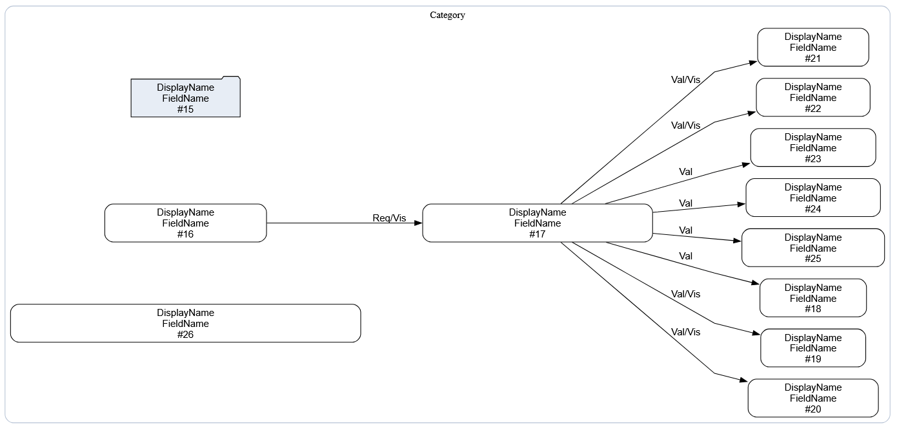
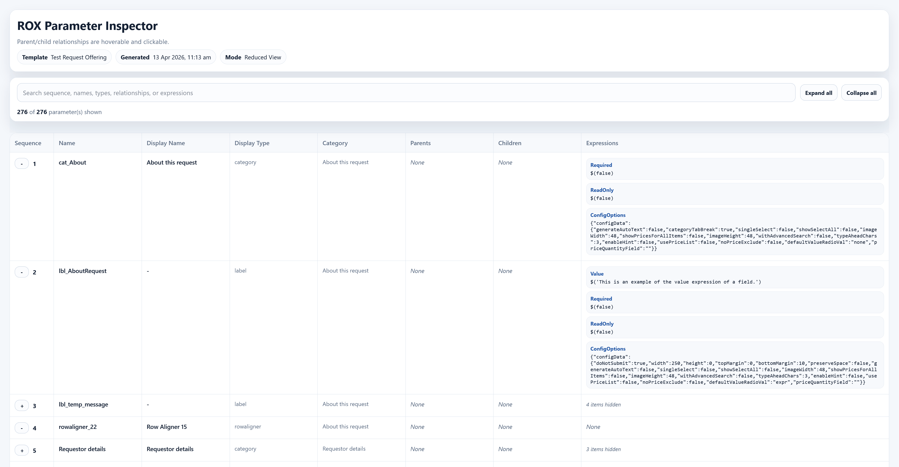
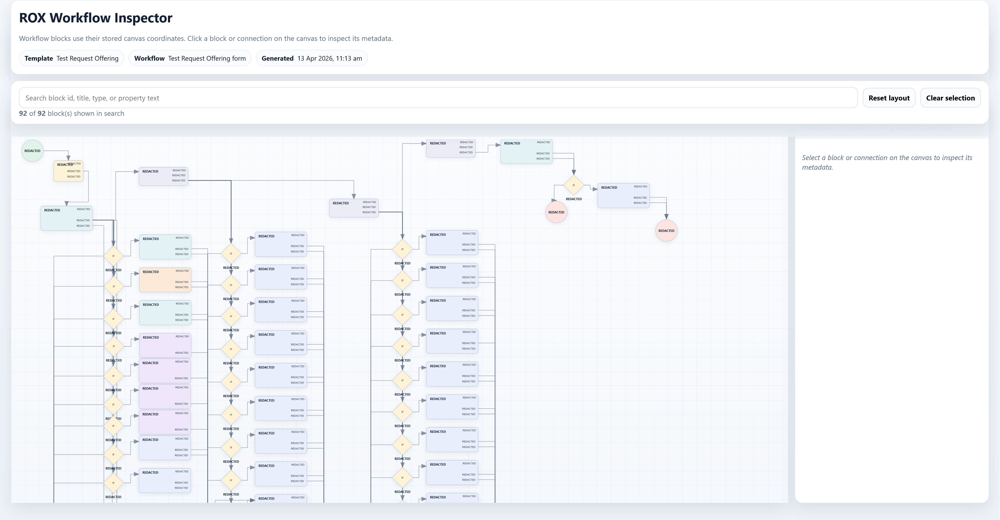

# Rox Parser

A tool to parse Ivanti .rox files and produce request offering and workflow visualisations. The tool is experimental in nature and has known shortcomings, use at your own discretion.

1. [General usage](#general-usage)
2. [Graphviz optional external dependency](#optional-external-dependency-notice)
3. [Examples and images](#examples)
4. [Known shortcomings](#known-shortcomings)

## General Usage

Rox Parser can be used from command line.

```powershell
rox-parser "rox file path" --export-default-set
```

There is one argument intended for general use, which is : --export-default-set

This will output a graph.svg, param_report.html and workflow_report.html to the current directory.

See rox-parser -h for all arguments and a brief description. Most arguments print to standard output, so they can be redirected:

```powershell
rox-parser "file_name.rox" --param-json > output.json
```

## Optional External Dependency Notice

Generating DOT graph svgs for parameters requires the Graphviz binary to be installed and accessible through PATH. Svg generation will be skipped and a warning presented if it is not installed.

## Examples

1. Below is a snippet of a directed graph svg. Rox Parser generates a directed graph to represent parent-child logical dependencies and optionally tries to render it as an svg if the Graphviz binary is installed. Field #16 is a parent of field #17, which is in turn a parent of many fields. This is a snippet which was produced by the --export-default-set argument, which applies transitive reduction to chains of dependencies to make them easier to read. Field 16 is the parent of every field beneath it. Transitive reduction reduces the number of field-to-field edges to the minimum required to represent the dependency relationships. Without it, field #16 would draw a line to every single field beneath it rather than only field #17.



2. Below is a snippet of a request offering parameter report. Rox Parser parses all the data in the request offering .rox file and tabulates it into a HTML report. The report shows the ID, display name, control type, category if it was beneath one in the request offering, parent fields, child fields and miscellaneous data in the expressions column. The parent and child fields can be hovered to inspect why the relationship is being displayed and clicked on to jump to the parent or child in question in the table. The table can be easily searched using the search bar at the top of the report.



3. Below is a snippet of a workflow report. Rox Parser parses all the data in the request offering .rox file and generates a visualisation of it. The visualisation attempts to roughly reproduce the form it would take in Ivanti's workflow editor. Each block is clickable and draggable. Clicking on a block shows will highlight it and any incoming or outgoing blocks. The click will also fill the inspector panel on the right hand side with any metadata that could be parsed.



## Known shortcomings

1. Rox Parser is currently biased to the developer's use case and isn't customisable. For example, it does not include field translations in the parameter table output because it is irrelevant in the developer's environment.

2. The logic behind the generation of the directed graph for request offering parameters is rudimentary at this time. It simply checks whether the ID of a parameter, such as "Employee", exists in the logical expressions of other parameters. Depending on how unique the ID of a given parameter is, it could overlap with the name of other system objects and cause false positive dependency relationships. For instance, consider this scenario: field A has the ID "Employee" and field B has a visibility expression containing a reference to the Employee# record table like "Employee.xyz". Under the current implementation, Field B will be considered a logically dependent child of field A regardless of whether that is true or not. This will be resolved later.

3. There is likely still untapped metadata that could be parsed and shown in the parameter and workflow reports. The tool is by no means comprehensive.
